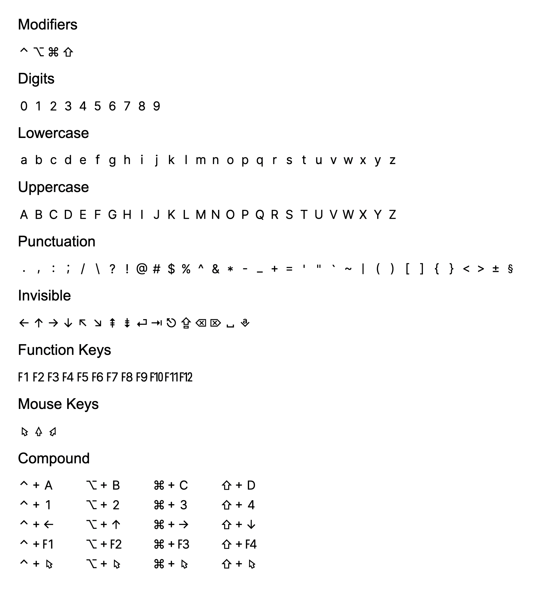

# Shortcuts Font ([DOWNLOAD](https://github.com/fabiospampinato/shortcuts-font/tree/master/resources/fonts))

A minimal font designed to beutifully render characters used for representing shortcuts.

This font provides glyphs for most of the strings listed [here](https://github.com/fabiospampinato/shosho/blob/bdc15f7ad2c1619c37f03bc4caac006329f3faa7/src/maps.ts#L646-L817).

This font is based on the wonderful [Inter](https://github.com/rsms/inter) font family.

---

---
